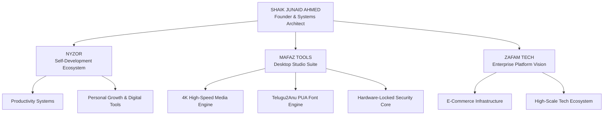

```markdown
<div align="center">

  

  <br/>

  

  <p align="center">
    
    
    
  </p>

</div>

<br/>

## SYSTEM OVERVIEW

```text
┌── [ SHAIK JUNAID AHMED // SYSTEM IDENTIFICATION ]
│
├── NYZOR         :: Self-Development & Productivity Ecosystem
├── MAFAZ TOOLS   :: High-Performance 4K Engine & Telugu2Anu Converter Suite
├── ZAFAM TECH    :: Large-Scale Enterprise Platform Vision
└── SECURITY      :: HWID Hardware Locking & Cryptographic Licensing
```

<br/>

---

## VENTURE ECOSYSTEM ARCHITECTURE



<br/>

---

## VENTURE & PRODUCT DETAILS

<table width="100%">
  <tr>
    <td width="33%" valign="top">
      <h3 align="center">NYZOR</h3>
      <p align="center"><code>Self-Development Ecosystem</code></p>
      <hr>
      <p>Nyzor is a digital self-development ecosystem designed to build discipline, track personal progress, and optimize daily productivity.</p>
    </td>
    <td width="33%" valign="top">
      <h3 align="center">MAFAZ TOOLS</h3>
      <p align="center"><code>Desktop Studio Suite</code></p>
      <hr>
      <p>A unified desktop suite featuring a 4K UHD YouTube media engine, Telugu2Anu font converter, and hardware-locked security licensing.</p>
    </td>
    <td width="33%" valign="top">
      <h3 align="center">ZAFAM TECH</h3>
      <p align="center"><code>Enterprise Technology</code></p>
      <hr>
      <p>A large-scale technology venture focused on enterprise platforms, e-commerce infrastructure, and high-scale systems architecture.</p>
    </td>
  </tr>
</table>

<br/>

---

## TECH ARSENAL

<div align="center">

<p align="center">
  <code>JavaScript</code> &bull; <code>Node.js</code> &bull; <code>React.js</code> &bull; <code>Electron.js</code> &bull; <code>Vite</code> &bull; <code>Python</code> &bull; <code>C++</code> &bull; <code>HTML5/CSS3</code>
</p>

<br/>

<p align="center">
  
</p>

</div>

<br/>

---

## OFFICIAL LINKS

<div align="center">

  <a href="https://nyzor-official.web.app">
    
  </a>
  <a href="mailto:specialjunaid69@gmail.com">
    
  </a>

</div>
```
