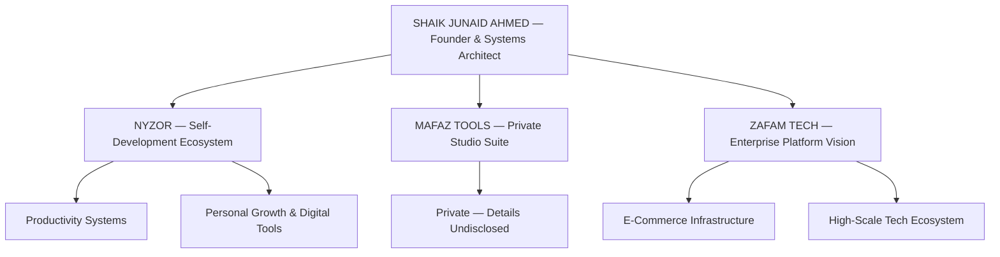

 

 

---

## SYSTEM OVERVIEW

| KEY | VALUE |
|:----|:------|
| PRIMARY VENTURE | NYZOR — Self-Development & Productivity Ecosystem |
| PRIVATE PROJECT | MAFAZ TOOLS — Private Studio Software Suite |
| FUTURE INITIATIVE | ZAFAM TECH — Large-Scale Enterprise Platform Vision |
| SECURITY CORE | HWID Hardware Locking & Cryptographic Licensing |

---

## VENTURE ECOSYSTEM ARCHITECTURE

---

## VENTURE & PRODUCT DETAILS

| VENTURE | TYPE | DESCRIPTION |
|:--------|:-----|:------------|
| NYZOR | Self-Development Ecosystem | Digital ecosystem to build discipline, track progress and optimize daily productivity |
| MAFAZ TOOLS | Private Studio Project | Large-scale private software project. Details undisclosed. |
| ZAFAM TECH | Enterprise Technology | Large-scale platforms, e-commerce infrastructure and high-scale systems architecture |

---

## TECH ARSENAL

---

## OFFICIAL LINKS

